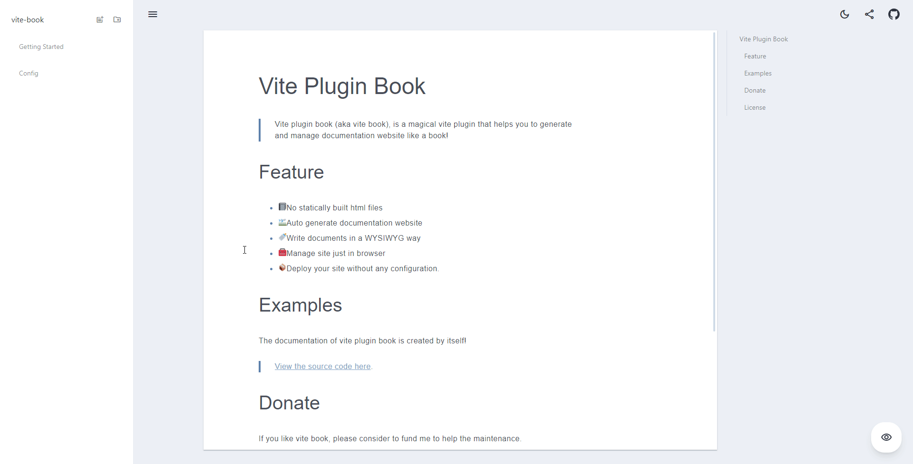
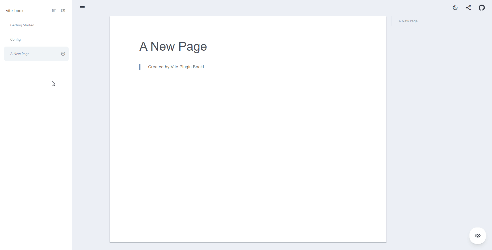
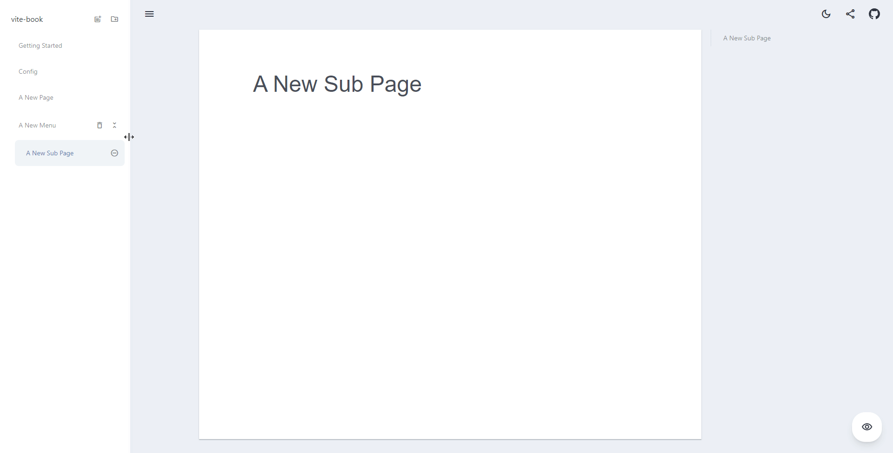
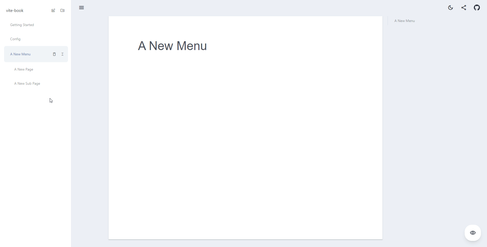
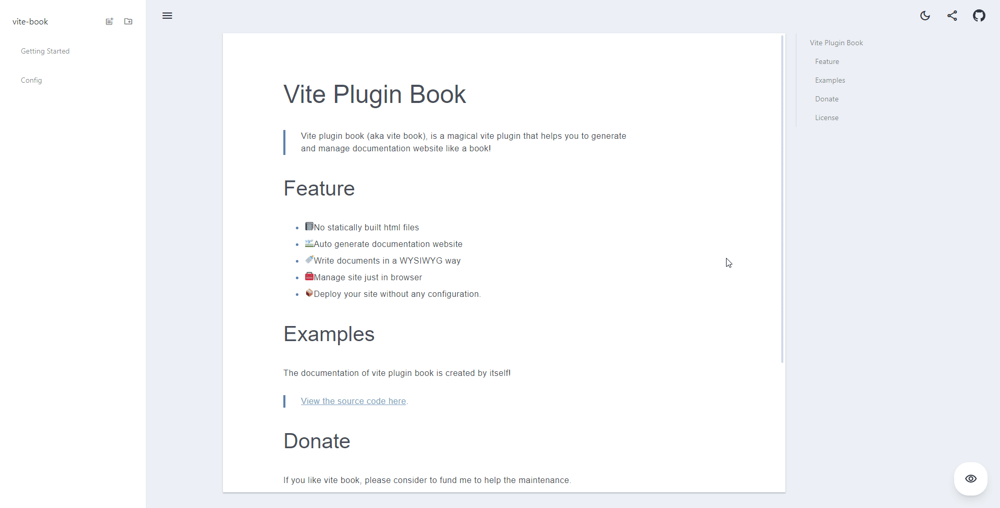

## Motivation

In the past few years, I tried lots of documentation generators, such as [docsify](https://docsify.js.org/), [docusaurus](https://docusaurus.io/), [docz](https://github.com/doczjs/docz), etc... But I couldn't find a good one that I liked for following reasons:

1. I have to switch between my markdown editor and the browser many times during writing docs to make sure they looks good. Which is really annoying when I only have one screen with me.
2. Sometimes I don't want to do so much configuration to just create a documentation site. For example, when creating a library. I just want my documentation site to be simple to setup and easy to write.
3. Markdown based documentation may block people that don't know how to use markdown. It's not common in programmers, but what about designers and PM? If they also want to contribute to the docs, they have to learn it first.

## Introducing Vite Book

So I created a new way to write and manage your documentation. It's called [Vite Book](https://github.com/Saul-Mirone/vite-plugin-book).
It's built on top of the [vite](https://vitejs.dev/) ecosystem. So you can use it as a vite plugin in your project.

### Quick Start

Init a project using vite and add the [vite-plugin-book](https://www.npmjs.com/package/vite-plugin-book) package as the dependency:

```bash
npm init vite@latest my-vite-book -- --template vanilla

cd my-vite-book

npm install --save vite-plugin-book
```

Then, open the `vite.config.js` and add the plugin:

```javascript
// vite.config.js
import { book } from 'vite-plugin-book/vite';

export default {
    plugins: [book()],
};
```

After that, you can just run `npm run dev`, and you'll see the following message in terminal:

```bash
vite dev server running at:

> Local: http://localhost:3000/
> Network: use `--host` to expose

ready in XXXms.

> Book Admin: http://localhost:3000/__vite_plugin_book__/
> Book Preview: http://localhost:3000/__vite_plugin_book__/__preview__/
```

Now you can view the book admin to play with your book!

### Overview

#### Create a new page:



#### Create a new menu:



#### Drag and drop to sort:



#### Delete items:



#### More User Interfaces:



### Deployment

You can also make your book available to the public.

Add following code to your `main.js`:

```javascript
// Don't forget to import css!
import 'vite-plugin-book/style.css';

import { renderBook } from 'vite-plugin-book';

renderBook({
    isProd: import.meta.env.PROD,
    baseUrl: import.meta.env.BASE_URL,
    container: '#app',
});
```

Then, you can observe the book in production with:

```bash
npm run dev
npm run preview
```

**In production, the book will be readonly. Editing the book is only possible in development mode**.

## Online playground

You can play with it on [stackblitz](https://stackblitz.com/edit/vitejs-vite-7u4cxt?file=package.json).

## Summary

For now, you've already get a book which you can:

1. Write and manage documents just in browser.
2. Ready for deployment.
3. Have mobile support, sidebar, dark mode, loading status, share, etc... out of the box. 

## What's next?

I'll continue work on this library to make it support more features. The following features are planned:

- plugin system
- theme system
- configurable editor
- i18n

## Support Me

If you like this idea, please consider to give it a 🌟 on [GitHub](https://github.com/Saul-Mirone/vite-plugin-book).
